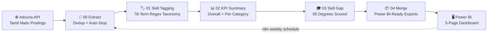
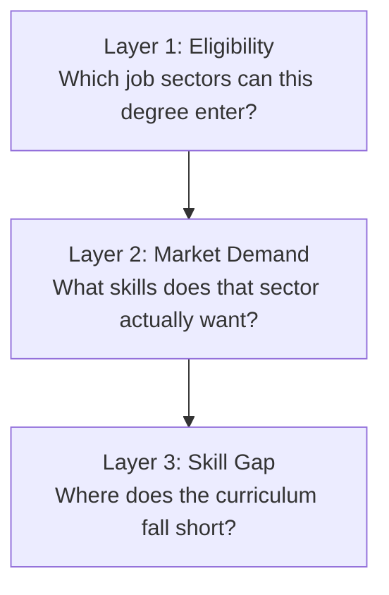
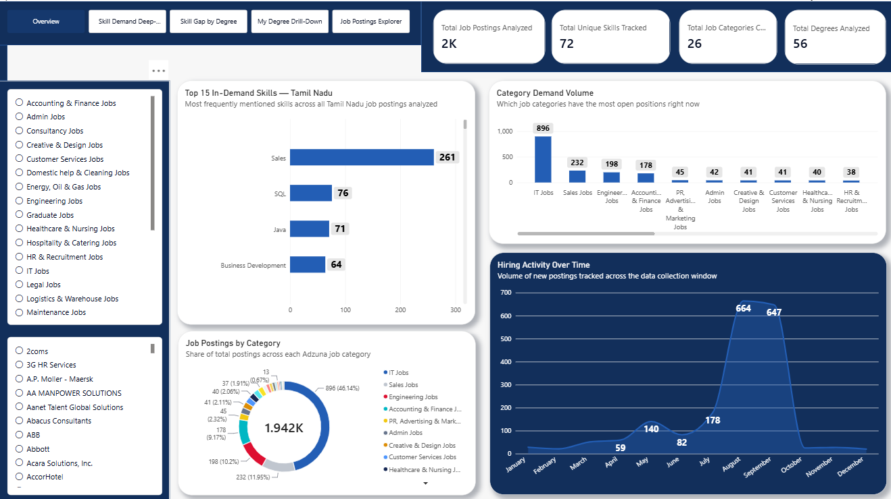
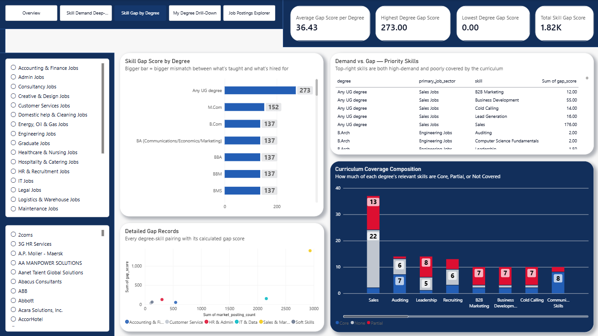

# 🎯 Career Pathway Intelligence
## *Mapping Degrees to Real Job Market Demand — Tamil Nadu*

  

     

 

## 🗺️ Table of Contents

| | | |
|:---:|:---:|:---:|
| 🎯 [Project Overview](#-project-overview) | 🔄 [The Process](#-the-process--how-this-came-together) | 🗂️ [Repository Structure](#-repository-structure) |
| 📊 [Dataset at a Glance](#-dataset-at-a-glance) | 🧭 [Methodology](#-methodology--section-by-section) | 💡 [Key Insights](#-key-insights) |
| 🎓 [The Skill Gap Deep-Dive](#-the-skill-gap-deep-dive) | 🏢 [Business Intelligence & Outlook](#-business-intelligence--future-outlook) | 📸 [Visual Gallery](#-visual-gallery) |
| 🐛 [Bugs Worth Talking About](#-bugs-worth-talking-about) | 🧠 [Skills Applied](#-skills-applied) | 🚀 [About Me](#-about-me) |

---

## 🎯 Project Overview

Every graduate faces the same three questions: *which career domains can my degree actually get me into, what does the market really want right now, and where exactly does my education fall short?* This project answers all three from scratch, using genuine live job market data pulled from the **Adzuna API** — nearly 2,000 real Tamil Nadu job postings, spanning 27 categories, tagged against a 78-skill taxonomy built from real Indian job posting patterns.

This wasn't a toy dataset. Company names were missing for real recruitment-agency listings, categories bled into each other because "sales experience" gets mentioned everywhere, and one entire skill taxonomy had to be built from scratch by cross-referencing Glassdoor and Internshala postings across six domains — IT & Data, Accounting & Finance, Sales & Marketing, HR & Admin, Customer Service, and Soft Skills. Every skill match was done with transparent regex pattern-matching, not an opaque AI classifier, so every single tagged skill can be traced back to the exact line of text that triggered it.

From there, the analysis went one layer deeper than a typical market report: it cross-referenced real market demand against **55 UG/PG degree programs**, using an **officially cited University of Madras B.Sc Mathematics syllabus PDF** as the gold-standard reference point — quantifying, in hard numbers, exactly where a Math/Stats/CS degree's curriculum falls short of what employers are actually asking for.

---

## 🔄 The Process — How This Came Together

### 🌐 Data Extraction
Real job postings were pulled directly from the **Adzuna API**, scoped to Tamil Nadu as a whole state rather than city-by-city, to avoid silently excluding smaller towns. The extraction script includes a dedup-and-stop safety mechanism — tracking every unique (title, company, location) combination and automatically halting after three consecutive pages return zero new postings, so the pipeline never wastes API quota re-pulling the same data.

### 🧹 Skill Tagging
Every posting's title and description was scanned against a **78-term skill taxonomy**, built as an external lookup CSV (skill, regex_pattern, skill_category) rather than hardcoded in the script — the same clean architecture pattern used in production hiring-intelligence pipelines. Regex matching was chosen deliberately over an AI/LLM classifier: every match is fully explainable and reproducible, with zero black-box risk.

### 📊 KPI Aggregation
Skill frequency was aggregated two ways — overall across all 1,932 postings, and separately within each of the 27 job categories — because "what skills does the market want" and "what does IT Jobs specifically want" are genuinely different questions with different answers.

### 🎓 Skill Gap Scoring
Each of 55 degree programs was scored Core/Partial/None against all six skill categories, then cross-multiplied against real market posting volume within that degree's primary job sector to produce a quantified **Gap Score** — a single number representing how badly a given degree's curriculum misses what the market actually wants.

### 🤖 Automation
The entire six-script pipeline — extraction through Power BI export — runs on a **weekly n8n schedule**, with dedicated success and failure email alerts wired through a separate Error Handler workflow, since n8n's error-catching only fires from outside the main execution chain.

---

## 🗂️ Repository Structure
**The pipeline, visually:**

**The insight layers:**

---

## 📊 Dataset at a Glance

| Metric | Value |
|---|:---:|
| **Total Job Postings Analyzed** | 1,932 |
| **Unique Skills Tracked** | 75 |
| **Job Categories Covered** | 27 |
| **Degree Programs Analyzed** | 56 |
| **Largest Category** | IT Jobs (830 postings) |
| **Top Skill Overall** | Sales (277 mentions, 14.3%) |
| **Top IT-Specific Skill** | Java (88 mentions) |
| **Postings Missing Company Name** | ~4.9% (agency listings) |

---

## 🧭 Methodology — Section by Section

**1. Extraction & Deduplication**
Every posting is keyed by (title, company, location) and checked against a running set before being added — genuine duplicates are silently skipped rather than double-counted, and the extraction loop halts itself after three consecutive pages add zero new unique postings, preventing runaway API usage.

**2. Skill Taxonomy Construction**
Rather than guessing skill keywords from memory, each domain's terms were sourced from real, current Indian job postings on Glassdoor and Internshala — 23 IT & Data terms, 15 Accounting & Finance terms, 15 Sales & Marketing terms, 10 HR & Admin terms, 5 Customer Service terms, and 10 cross-cutting Soft Skills terms, each stored with its own regex pattern in an external lookup CSV.

**3. Category-Aware Aggregation**
Skill demand was computed both globally and per-category, because a keyword like "sales" appearing in an Accounting job description ("assist the sales team") would otherwise wrongly inflate a single global number — the category-level breakdown makes that cross-category bleed visible and explainable rather than hidden.

**4. Degree Coverage Scoring**
55 UG/PG programs were scored Core / Partial / None across the same six skill categories used in the taxonomy — with B.Sc Mathematics singled out for full, independently-cited verification against the actual official University of Madras syllabus PDF, rather than general knowledge alone.

**5. Gap Score Calculation**
For each degree, real market posting counts within that degree's primary job sector were multiplied by a coverage penalty (None = full gap, Partial = half gap, Core = no gap), producing a single quantified Gap Score per skill per degree — higher score means a bigger real mismatch between curriculum and market demand.

**6. Dashboard & Automation**
Five Power BI pages — Overview, Skill Demand Deep-Dive, Skill Gap by Degree, My Degree Drill-Down, and Job Postings Explorer — were built on a clean single-relationship data model, then wired into an n8n workflow that runs the full six-script pipeline weekly with automated email alerts on both success and failure.

---

## 💡 Key Insights

- **IT Jobs dominates by volume** — 830 postings, more than triple the next-largest category (Sales Jobs, 247), confirming Tamil Nadu's tech hiring is genuinely substantial, not just a perception.
- **"Sales" ranks #1 overall (277 mentions, 14.3%) — not because Sales Jobs alone drove it**, but because the word appears generically across many unrelated postings ("assist the sales team" showing up even in Accounting and Engineering listings) — a real, honestly-documented limitation of keyword-based extraction rather than a hidden flaw.
- **Within IT Jobs specifically, the clean signal is Java (88), Python (58), JavaScript (45), and SQL (45)** — genuinely representative of real technical hiring demand, unpolluted by cross-category noise.
- **Soft skills rank surprisingly high** — Leadership (73 mentions) and Communication Skills (51 mentions) both outrank several hard technical skills, including Excel.
- **~4.9% of postings have no disclosed company name** — verified directly against sample descriptions, confirming genuine recruitment-agency listings rather than a scraping failure.

---

## 🎓 The Skill Gap Deep-Dive

| Degree | Primary Sector | Gap Score | What It Means |
|---|---|:---:|---|
| Any UG Degree | Sales Jobs | 288.0 | Expected — generic eligibility, zero specific training |
| **B.Sc Mathematics** | **IT Jobs** | **146.0** | **The project's core finding — see below** |
| B.Com / BBA / BMS / BBM / M.Com / PGDM | Sales Jobs | 144.0 (each) | Shared gap pattern across business-generalist degrees |
| B.Sc (Statistics/Actuarial Science) | Accounting & Finance | 49.5 | Strongest quantitative alignment among UG degrees |

**The B.Sc Mathematics finding, verified against the official University of Madras syllabus:**

The curriculum covers 15 core papers of pure theoretical mathematics (Algebra, Real Analysis, Complex Analysis) plus two genuinely strong Mathematical Statistics allied papers — but programming exposure exists **only as an elective** (Programming in C, or Python), meaning it isn't guaranteed for every graduate. SQL, Excel, and Power BI appear **nowhere** in the official syllabus.

Cross-referenced against real IT Jobs market demand:

| Skill | Real Market Demand | Degree Coverage | Resulting Gap |
|---|:---:|:---:|:---:|
| Java | 88 postings | Partial (elective only) | 44.0 |
| Python | 58 postings | Partial (elective only) | 29.0 |
| Leadership | 28 postings | None | 28.0 |
| JavaScript | 45 postings | Partial | 22.5 |
| SQL | 45 postings | Partial | 22.5 |

---

## 🏢 Business Intelligence & Future Outlook

The B.Sc Mathematics gap score of 146 isn't an abstract number — it's a direct, quantified answer to "what should I actually spend my time learning after this degree?" The math is unambiguous: SQL, Python, and Java carry real, verified market demand, and the official syllabus leaves them entirely optional or absent. That's not a criticism of the degree — the statistics and analytical-reasoning foundation it builds is genuinely valuable and confirmed in demand — it's a precise map of exactly where self-directed upskilling needs to happen.

Looking ahead, the natural next layer is expanding the same fully-cited syllabus verification — currently done rigorously for B.Sc Mathematics alone — across a few more high-volume degree programs (B.Com, BCA, BBA), replacing their currently indicative-only coverage scores with the same official-source rigor. A second natural extension: layering month-over-month trend tracking once the n8n weekly automation has accumulated enough historical runs to show genuine skill demand shifts over time, not just a single snapshot.

---

## 📸 Visual Gallery

### 1️⃣ Overview Dashboard

*Top 15 in-demand skills, category demand volume, and hiring activity trend — all computed from 1,932 real, deduplicated Tamil Nadu job postings.*

### 2️⃣ Skill Gap by Degree

*The project's signature page — quantified mismatch between what 55 degree programs teach and what the market actually demands, with the B.Sc Mathematics finding fully traceable to an official university syllabus.*

---

## 🐛 Bugs Worth Talking About

**The `os.getenv()` swap.** Early in the pipeline build, the extraction script read `os.getenv("48e85034")` instead of `os.getenv("ADZUNA_APP_ID")` — the actual API key value had gotten pasted in place of the environment variable *name*, so Python was correctly searching for an environment variable that never existed. The fix was simple once traced, but it's a genuine reminder that copy-pasting credentials into code, even briefly, is exactly how leaks happen — the real fix was routing everything through a `.env` file from that point on.

**The cyclic reference in Power BI.** After importing five independent CSV exports, Power BI's auto-detect relationships feature silently linked tables that were only ever meant to stand alone — `skill_demand_summary` → `category_skill_breakdown` → `adzuna_tn_jobs_with_skills` → `skill_gap_by_degree` → back to `skill_demand_summary`, a closed loop that broke every refresh. The fix was deleting every auto-detected relationship except the one genuinely needed (`skill_gap_by_degree[degree]` → `degree_skill_coverage[degree]`), and disabling Power BI's Auto Date/Time feature, which was quietly generating hidden date tables that fed the same loop.

**The unquoted comma in a CSV.** The `degree_skill_coverage.csv` reference file failed to load with `Expected 10 fields in line 22, saw 11` — a notes field containing "Specialized technical depth, limited business skills" had an internal comma with no surrounding quotes, so pandas read it as an extra column. A one-character fix (comma → semicolon), but a useful reminder that free-text fields in CSVs need real care.

---

## 🧠 Skills Applied

- **API Integration & Defensive Extraction** — building a dedup-and-auto-stop extraction loop against a real, rate-limited public API, rather than a naive unlimited pull.
- **Transparent Skill Classification** — choosing regex/keyword matching over an AI classifier specifically for full explainability, and documenting *why* that trade-off was made.
- **Cross-Referencing Against Primary Sources** — verifying a curriculum claim not against general knowledge, but against an actual official university syllabus PDF, and being explicit about which claims are cited versus indicative.
- **Data Model Debugging** — diagnosing and resolving a genuine cyclic reference in Power BI's relationship graph, not just clicking "Autodetect" and hoping it worked.
- **Pipeline Orchestration** — wiring a six-stage Python ETL pipeline into a scheduled, alert-driven n8n workflow with a properly separated error-handling path.

---

## 🚀 About Me

I'm **Bernad Meckenzi S** — transitioning into Data Analytics / Business Intelligence, currently working as a Process Associate in medical billing. B.Sc. in Mathematics from Loyola College, Chennai, and a firm believer that a finding only counts once you can point to exactly where it came from.

| 🔧 Skill Area | 🌟 Tools |
|---|---|
| 🗄️ Business Intelligence | Power BI, DAX, Power Query |
| 🐍 Programming | Python, Pandas, NumPy |
| 🗃️ Data Querying | SQL |
| ⚙️ Automation | n8n, ETL pipeline design |
| 📈 Visualization | Matplotlib, Seaborn |
| 🧠 Core Strength | Tracing Every Claim Back to Its Source |

My approach is simple: **pull real data, tag it transparently, verify claims against primary sources wherever possible, and document every limitation honestly rather than hiding it** — because that's what makes a finding trustworthy enough to act on.

---

## 📫 Let's Connect

⭐ **If this project helped you see how a real degree-to-market skill gap gets quantified, a star would mean a lot.**

