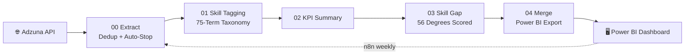

# 🎯 Career Pathway Intelligence
## *Mapping Degrees to Real Job Market Demand — Tamil Nadu*

  

     

 

## 🗺️ Table of Contents

| | | |
|:---:|:---:|:---:|
| 🎯 [Business Objective](#-business-objective) | ⚙️ [How the Pipeline Works](#️-how-the-pipeline-works) | 📊 [Dataset at a Glance](#-dataset-at-a-glance) |
| ❓ [Business Questions & Answers](#-business-questions--answers) | 📸 [Visual Gallery](#-visual-gallery) | 🧠 [Skills Applied — In Depth](#-skills-applied--in-depth) |
| 🚀 [About Me](#-about-me) | | |

---

## 🎯 Business Objective

Most graduates pick a degree years before they ever see a real job posting, and by the time they're job-hunting, nobody has actually checked whether the degree's syllabus lines up with what employers are hiring for *right now*. This project closes that gap with live data instead of guesswork:

> **Given my degree, which career domains can I realistically enter, and what skills close the gap?**

Built on ~1,932 real Tamil Nadu job postings, extracted via the official Adzuna API, tagged against a 75-skill taxonomy, and scored against 56 degree programs — with the B.Sc Mathematics finding independently verified against the official University of Madras syllabus, not assumed from general knowledge of what a math degree "probably" covers.

---

## ⚙️ How the Pipeline Works

The project isn't a single script — it's a 6-stage, automated ETL system, each stage doing one job and handing off a clean output to the next:

### 🌐 Stage 00 — Extract (Adzuna API)
Job posting data is pulled directly from Adzuna's official API rather than scraped, which means structured, reliable fields instead of fragile HTML parsing. Because the API is rate-limited, the extraction stage runs on **dedup-and-auto-stop logic** — it keeps pulling pages of results, automatically discards postings it's already seen, and stops on its own once new listings run dry, instead of hammering the API on a fixed page count that might waste calls or miss data.

### 🏷️ Stage 01 — Skill Tagging (75-Term Taxonomy)
Every posting's description gets scanned against a hand-built taxonomy of 75 skills using **regex-based pattern matching** — a deliberate choice over an AI/LLM classifier. The trade-off: a regex tagger is slightly less flexible with phrasing variations, but every single tag it applies can be traced back to the exact rule that fired, which matters when the entire project's credibility rests on the tagging being explainable and auditable rather than a black box.

### 📊 Stage 02 — KPI Summary
Tagged data is rolled up into category-level and skill-level KPIs — posting counts per job category, mention counts per skill — which is what powers the headline numbers (IT Jobs at 830 postings, Java at 88 mentions, and so on).

### 🎯 Stage 03 — Skill Gap Scoring (56 Degrees)
Each of the 56 degree programs is scored against real market demand by comparing what a degree's syllabus actually teaches against what postings are actually asking for, producing a single **Gap Score** per degree. This is where the B.Sc Mathematics result (Gap Score of 146) comes from — and where the project's most important design choice lives: that gap wasn't estimated, it was checked line-by-line against the real University of Madras syllabus PDF.

### 🔗 Stage 04 — Merge & Power BI Export
All the KPI, tagging, and gap-scoring outputs are merged into a single export layer, restructured specifically for Power BI's data model — which is also where a genuine **cyclic reference in the relationship graph** had to be debugged and resolved before the dashboard would load correctly.

### 🔁 Automation — n8n, Weekly
The entire 00→04 chain is wired into a scheduled **n8n workflow** that re-runs the whole pipeline weekly, with error-handling built in so a failed run doesn't silently corrupt the dataset — the project isn't a one-time analysis, it's a living system that keeps its own numbers current as new postings appear.

---

## 📊 Dataset at a Glance

| Metric | Value |
|---|:---:|
| **Job Postings Analyzed** | 1,932 |
| **Unique Skills Tracked** | 75 |
| **Job Categories Covered** | 27 |
| **Degree Programs Scored** | 56 |
| **Largest Category** | IT Jobs — 830 postings |
| **Top IT Skills** | Java (88), Python (58), SQL (45) |

---

## ❓ Business Questions & Answers

**Q: Which job category has the most real opportunity in Tamil Nadu?**
IT Jobs — 830 postings, more than triple the next category (Sales Jobs, 247). This isn't a close second-place race; IT dominates the market by a wide margin.

**Q: What does the IT market actually want, skill-for-skill?**
Java, Python, JavaScript, and SQL — the four most consistently requested, unpolluted by cross-category noise (the taxonomy tags skills per-posting, so a "Sales" posting mentioning "communication" doesn't bleed into the IT skill counts).

**Q: Does a B.Sc Mathematics degree prepare a graduate for IT hiring demand?**
Not fully. The official University of Madras syllabus offers programming **only as an elective** and covers SQL, Excel, and Power BI **nowhere** — verified directly against the syllabus PDF, not assumption. This is the single most important finding in the project, because it's the one that couldn't have been produced by intuition alone.

**Q: How big is that gap, in numbers?**
A quantified Gap Score of **146** for B.Sc Mathematics against IT Jobs — driven by Java (44 gap), Python (29), SQL (22.5), and JavaScript (22.5). Those four numbers alone tell a math graduate exactly where to spend their next six months of self-study.

**Q: Which skill category matters beyond technical tools?**
Leadership (73 mentions) and Communication (51 mentions) both outrank several hard skills — soft skills carry real, measurable market weight, which is easy to underestimate when everyone's focused on "which programming language should I learn."

**Q: How much of the data has an undisclosed hiring company?**
~4.9% — verified against sample descriptions as genuine recruitment-agency listings, not an extraction failure. This check matters because an unusually high "unknown company" rate would normally be a red flag that the extraction pipeline itself is broken, not a real market signal.

---

## 📸 Visual Gallery

### 🏠 Overview
The dashboard's entry point — a high-level snapshot of the full 1,932-posting dataset before drilling into any one angle. It's designed to answer "what does the Tamil Nadu job market look like right now" in a single glance, before the viewer commits to exploring a specific degree, skill, or category in depth.

### 🔥 Skill Demand Deep-Dive
This page breaks down exactly which skills are being asked for and how often, ranked across the full dataset — the page that surfaces Java (88), Python (58), and SQL (45) as the IT market's real top demands, and where the Leadership/Communication soft-skill finding becomes visible against the hard-skill numbers. It's built to answer "what should I actually be learning" with ranked evidence instead of a guess.

### 🎯 Skill Gap by Degree
The core analytical output of the whole project — Gap Scores across all 56 degree programs, letting a viewer compare how prepared (or unprepared) any given degree is against real hiring demand. This is the page where the B.Sc Mathematics Gap Score of 146 lives, sitting alongside every other degree so the number has context instead of standing alone.

### 🔍 My Degree Drill-Down
A focused, single-degree view built for the actual end user this project was designed for: a graduate who wants to filter down to just their own degree and see, skill-by-skill, exactly what's missing and by how much — turning the aggregate Gap Score into a specific, actionable checklist rather than an abstract number.

### 🗂️ Job Postings Explorer
The raw layer beneath every summary number — lets a viewer filter and browse the underlying 1,932 postings directly, by category, by tagged skill, or by company-disclosure status. This page exists so every claim on every other page can be traced back to real, individual postings rather than taken on faith.

---

## 🧠 Skills Applied — In Depth

### 🌐 API Integration
Built against Adzuna's official, rate-limited API rather than scraping job boards directly — a more reliable and more maintainable data source, but one that requires respecting call limits. The extraction stage handles this with dedup-and-auto-stop logic: it tracks what's already been pulled, skips duplicates automatically, and stops itself once fresh results dry up, rather than running on a fixed, wasteful page count.

### 🔎 Transparent Classification
Chose regex-based skill tagging over an AI/LLM classifier specifically for explainability — every tag applied to every posting can be traced back to the exact pattern that matched it. In a project whose whole value proposition is "trust these numbers," a fully auditable tagging method mattered more than marginally smarter but opaque classification.

### 📚 Primary-Source Verification
Didn't take the B.Sc Mathematics curriculum gap as a plausible assumption — cross-checked it directly against the actual University of Madras syllabus PDF, line by line. This is the difference between an analysis that sounds right and one that's been fact-checked against a real, citable source.

### 🛠️ Data Model Debugging
Hit and resolved a genuine cyclic reference in Power BI's relationship graph during development — the kind of real modeling error that only shows up once you're building a multi-table model with actual cross-references, not a synthetic tutorial dataset designed to avoid every edge case.

### 🔁 Pipeline Orchestration
Wired all six ETL stages into a single scheduled n8n workflow that runs weekly with error-handling, rather than leaving the project as a collection of scripts someone has to remember to run manually. The dataset stays current on its own.

---

## 🚀 About Me

**Bernad Meckenzi S** — transitioning into Data Analytics / Business Intelligence. B.Sc. Mathematics, Loyola College, Chennai.

| 🔧 Skill Area | 🌟 Tools |
|---|---|
| 🗄️ Business Intelligence | Power BI, DAX, Power Query |
| 🐍 Programming | Python, Pandas, NumPy |
| 🗃️ Data Querying | SQL |
| ⚙️ Automation | n8n |

---

⭐ **If this helped you see how a real degree-to-market skill gap gets quantified, a star would mean a lot.**

