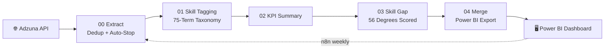
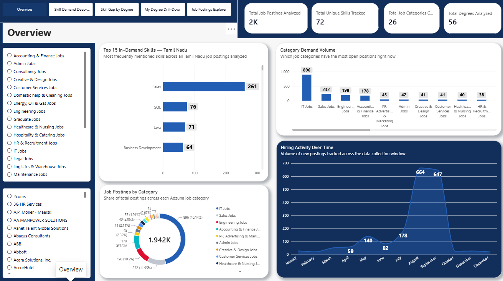

# 🎯 Career Pathway Intelligence
## *Mapping Degrees to Real Job Market Demand — Tamil Nadu*

  

     

 

## 🗺️ Table of Contents

| | | |
|:---:|:---:|:---:|
| 🎯 [Business Objective](#-business-objective) | 🗂️ [Repository Structure](#-repository-structure) | 📊 [Dataset at a Glance](#-dataset-at-a-glance) |
| ❓ [Business Questions & Answers](#-business-questions--answers) | 📸 [Visual Gallery](#-visual-gallery) | 🧠 [Skills Applied](#-skills-applied) |
| 🚀 [About Me](#-about-me) | | |

---

## 🎯 Business Objective

Graduates choose a degree with little visibility into real hiring demand. This project answers, using live job market data:

> **Given my degree, which career domains can I realistically enter, and what skills close the gap?**

Built on ~1,932 real Tamil Nadu job postings, extracted via the Adzuna API, tagged against a 75-skill taxonomy, and scored against 56 degree programs — with the B.Sc Mathematics finding independently verified against the official University of Madras syllabus.

---

## 🗂️ Repository Structure

---

## 📊 Dataset at a Glance

| Metric | Value |
|---|:---:|
| **Job Postings Analyzed** | 1,932 |
| **Unique Skills Tracked** | 75 |
| **Job Categories Covered** | 27 |
| **Degree Programs Scored** | 56 |
| **Largest Category** | IT Jobs — 830 postings |
| **Top IT Skills** | Java (88), Python (58), SQL (45) |

---

## ❓ Business Questions & Answers

**Q: Which job category has the most real opportunity in Tamil Nadu?**
IT Jobs — 830 postings, more than triple the next category (Sales Jobs, 247).

**Q: What does the IT market actually want, skill-for-skill?**
Java, Python, JavaScript, and SQL — the four most consistently requested, unpolluted by cross-category noise.

**Q: Does a B.Sc Mathematics degree prepare a graduate for IT hiring demand?**
Not fully. The official University of Madras syllabus offers programming **only as an elective** and covers SQL, Excel, and Power BI **nowhere** — verified directly against the syllabus PDF, not assumption.

**Q: How big is that gap, in numbers?**
A quantified Gap Score of **146** for B.Sc Mathematics against IT Jobs — driven by Java (44 gap), Python (29), SQL (22.5), and JavaScript (22.5).

**Q: Which skill category matters beyond technical tools?**
Leadership (73 mentions) and Communication (51 mentions) both outrank several hard skills — soft skills carry real, measurable market weight.

**Q: How much of the data has an undisclosed hiring company?**
~4.9% — verified against sample descriptions as genuine recruitment-agency listings, not an extraction failure.

---

## 📸 Visual Gallery

### Overview
High-level snapshot of the job market dataset — entry point for the rest of the dashboard.

### Skill Demand Deep-Dive
Breaks down the most-requested skills across all 1,932 postings — Java, Python, SQL, and JavaScript lead the IT category.

### Skill Gap by Degree
The core finding: Gap Scores across all 56 degree programs against real hiring demand, including the B.Sc Mathematics Gap Score of 146.

### My Degree Drill-Down
A focused, single-degree view — lets a graduate pick their own degree and see exactly which skills close their personal gap.

### Job Postings Explorer
Browse and filter the underlying 1,932 postings directly — by category, skill, or company disclosure status.

---

## 🧠 Skills Applied

- **API Integration** — dedup-and-auto-stop extraction against a rate-limited public API
- **Transparent Classification** — regex-based skill tagging, chosen over an AI classifier for full explainability
- **Primary-Source Verification** — cross-checking a curriculum claim against an official syllabus, not general knowledge
- **Data Model Debugging** — resolving a genuine cyclic reference in Power BI's relationship graph
- **Pipeline Orchestration** — six-stage ETL wired into a scheduled n8n workflow with error-handling

---

## 🚀 About Me

**Bernad Meckenzi S** — transitioning into Data Analytics / Business Intelligence. B.Sc. Mathematics, Loyola College, Chennai.

| 🔧 Skill Area | 🌟 Tools |
|---|---|
| 🗄️ Business Intelligence | Power BI, DAX, Power Query |
| 🐍 Programming | Python, Pandas, NumPy |
| 🗃️ Data Querying | SQL |
| ⚙️ Automation | n8n |

---

⭐ **If this helped you see how a real degree-to-market skill gap gets quantified, a star would mean a lot.**

